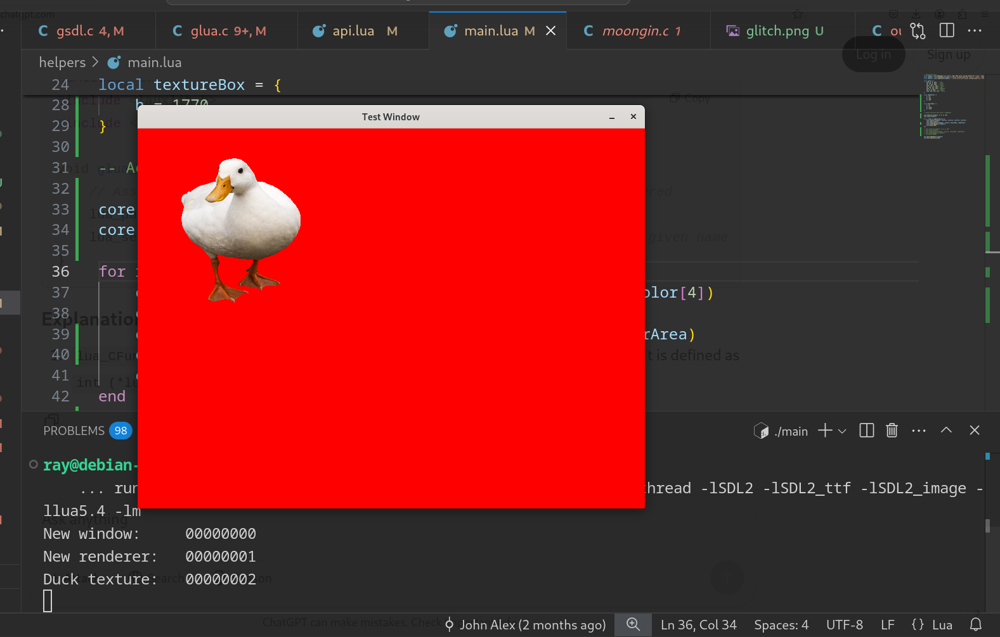

# Moongin

is the Modula game engine.
It will be using Lua as the core language,
and will be built against SDL2.

_Screenshot from most recent test:_

## Architecture

`moongin.brew` takes in a `*.lua` file to bake in as the main function
and then writes a `main.c` and configures some compiler variables
to produce a binary for Windows, Linux, and Mac

`src/payload` contains source code for
the engine that gets bundled into the main executable

`console.c` is a tiny debugging console that allows typing in
Lua commands that will be immediately executed by the engine

`glua.c` contains glue functions for connecting Lua functions to the engine

`gsdl.c` contains glue functions for SDL2 to the engine

## Moongin API

Methods for interacting with the engine's entity tables are in `id`
| Function | Interface | Notes |
| -------- | ----------- | ---------------------------------------- |
| `core.id` | <abbr title="int: id">`int`</abbr> ➔ `void *` | returns `NULL` on error |
| `core.parseid` | <abbr title="str: id">`str`</abbr> ➔ `void *` | returns `NULL` on error |

Methods for interacting with windows are all in `gfx`

| Function | Interface | <abbr title="Source of Truth">sot</abbr> |
| -------- | ----------- | ---------------------------------------- |
| `gfx.newWindow` | `title, width, height` ➔ `id` | [SDL_CreateWindow](https://wiki.libsdl.org/SDL2/SDL_CreateWindow) |
| `gfx.destroyWindow` | `id` | [SDL_DestroyWindow](https://wiki.libsdl.org/SDL2/SDL_DestroyWindow) |
| `gfx.newRenderer` | `window, flags` ➔ `id` | [SDL_CreateRenderer](https://wiki.libsdl.org/SDL2/SDL_CreateRenderer) |
| `gfx.presentRenderer` | `id` | [SDL_RenderPresent](https://wiki.libsdl.org/SDL2/SDL_RenderPresent) |
| `gfx.destroyRenderer` | `id` | [SDL_DestroyRenderer](https://wiki.libsdl.org/SDL2/SDL_DestroyRenderer) |
| `gfx.loadTexture` | <abbr title="id: renderer, filename: texture">`id, filename`</abbr> ➔ `id` | [IMG_LoadTexture](https://wiki.libsdl.org/SDL2_image/IMG_LoadTexture) |
| `gfx.renderTexture` | <abbr title="id: renderer, id: texture, box: texture area, box: renderer location">`id, id, box, box`</abbr> | [SDL_RenderCopy](https://wiki.libsdl.org/SDL2/SDL_RenderCopy) |
| `gfx.setColor` | <abbr title="int: red, int: green, int: blue, int: alpha">`int, int, int, int` | [SDL_SetRenderDrawColor](https://wiki.libsdl.org/SDL2/SDL_SetRenderDrawColor) |
| `gfx.clear` | <abbr title="id: renderer">`id`</abbr> | [SDL_RenderClear](https://wiki.libsdl.org/SDL2/SDL_RenderClear), [SDL_RenderPresent](https://wiki.libsdl.org/SDL2/SDL_RenderPresent) |
| `gfx.delay` | <abbr title="int: number of milliseconds">`int`</abbr> | [SDL_Delay](https://wiki.libsdl.org/SDL2/SDL_Delay) |

`gfx.flags` contains tables with the available flag values for windows and renderers.